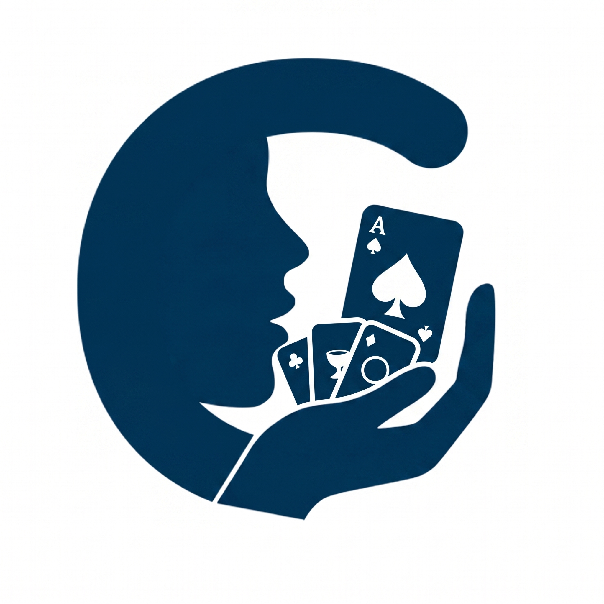
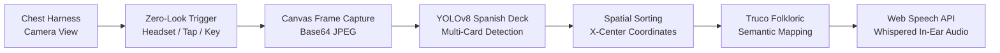
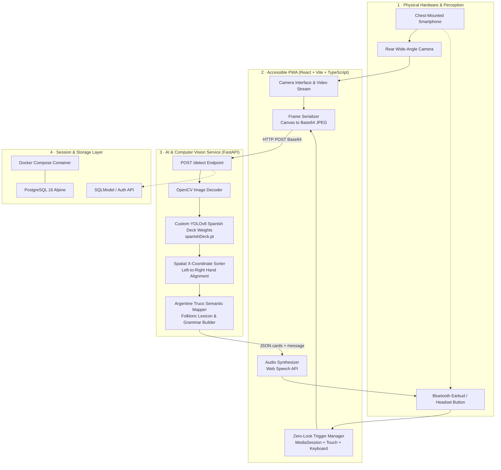

<div align="center">



# Cómplice AI 🃏👁️

**Leveling the playing field in Truco through real-time assistive computer vision.**

*A silent AI partner empowering blind and visually impaired players with spatial card awareness and stealth audio feedback.*

[](frontend/)
[](frontend/)
[](backend/)
[](backend/)
[](backend/services/yolo_service.py)
[](frontend/)
[](frontend/src/components/CameraInterface.tsx)

**Cómplice AI by the team**

</div>

---

Truco is Argentina’s most iconic card game: a ritual of psychological warfare, deceptive bluffing, subtle facial gestures (*señas*), and lightning-fast plays. 

For blind or visually impaired players, participating on equal terms has historically been impossible. Braille cards offer tactile feedback, but touching them exposes hesitation, destroys the secrecy of the hand, and telegraphs card positions to rivals. 

**Cómplice AI** turns a chest-mounted smartphone and a single wireless earbud into a discreet, silent partner. Using a specialized computer vision model trained on the Spanish Card Deck (*Baraja Española*), it scans the player's cards, sorts them spatially from left to right, translates them into Argentine Truco jargon, and whispers them into the player’s ear in milliseconds.

```text
Player:     [Discreetly double-taps headphone button or taps phone]
Cómplice:   "Tienes el macho, el tres de espada y el siete de oro."
            (Left-to-right hand order: 1-Espada, 3-Espada, 7-Oro)

Opponent:   "¡Envido!"

Player:     "¡Quiero treinta y tres!"
```

> [!IMPORTANT]
> **Vision senses. Rules classify. Audio whispers. The human bluffs.**
> Cómplice AI is strictly an accessibility assistive layer, not an automated bot. It does not decide what card to play, nor does it display sensitive information to opponents. It restores personal autonomy, ensuring visually impaired players can enjoy the psychological thrill and social intimacy of Truco on equal ground.

> [!NOTE]
> **Zero-Look Interaction:** Designed for blind and low-vision users. The system leverages background audio loop tricks via the browser’s **Web MediaSession API**, enabling hardware headphone buttons (Play/Pause/Next) and screen double-taps to trigger instant image capture without waking up or looking at the screen.

---

## Why Truco Needs an Assistive AI Partner

Truco cannot be played with traditional accessibility aids without sacrificing the core essence of the game:

1. **The Secrecy Dilemma:** A player holds 3 cards. If a blind player must touch braille markings, rivals can observe which card is being inspected and read their timing.
2. **Spatial Hand Awareness:** Knowing *what* cards you hold is only half the battle. A player must know *which physical card is on the left, center, or right* to throw the intended card onto the table without revealing the other two.
3. **The Argentine Truco Lexicon:** Cards are not referred to by their raw numbers. A card is *"el macho"* (1 of Spades), *"la hembra"* (1 of Bastos), or *"el siete bravo"*. Fast decisions require authentic game vocabulary, not robotic readings.
4. **Discreet Stealth:** Communication must be private. Audio feedback is tailored to be ultra-concise and fed directly into a single Bluetooth earbud.

---

## From Hand Draw to Stealth Whisper

Cómplice AI transforms real-time video into spoken awareness through an ultra-low latency assistive loop:



### Core Product Surfaces

| Surface | What it solves | Accessibility Feature |
|---|---|---|
| **Zero-Look Camera** | Continuous camera standby without battery drain or overheating | Dark mode, off-screen operation, tactile status dots |
| **Hardware Trigger Engine** | Captures hands without looking at or unlocking the phone | MediaSession API (headphone buttons), double-tap, keyboard listener |
| **Spatial Hand Sorter** | Orders detected cards from leftmost to rightmost card | Bounding box X-axis (`xywh[0]`) sorting so the player draws accurately |
| **Argentine Truco Engine** | Maps card codes into natural Argentine gaming vernacular | Translates `1-ESPADA` → *"el macho"*, `1-BASTO` → *"la hembra"*, etc. |
| **High-Contrast PWA** | Friendly onboarding and configuration for low-vision users | Black & Yellow (`#FACC15`) contrast, large touch targets (`py-8`), screen-reader friendly |
| **Device & Key Calibrator** | Lets users bind preferred external buttons or switch lenses | Multi-camera selector, custom key listener, persistent local preferences |

---

## System Architecture



---

## Technical Deep-Dive

### 1. Computer Vision & Custom YOLOv8 Model
Standard card detection models are trained on Anglo-French poker cards (Hearts, Spades, Diamonds, Clubs). Truco is played with the **40-card Spanish Deck** (*Espadas, Bastos, Oros, Copas*).
- **Model:** YOLOv8 trained specifically on Spanish card decks under complex angles, lighting, and partial overlaps (`spanishDeck.pt`).
- **Inference Parameters:** Confidence threshold (`conf=0.5`), intersection-over-union (`iou=0.5`), and class-agnostic Non-Maximum Suppression (`agnostic_nms=True`) to handle fanned-out hands cleanly.

### 2. Spatial Left-to-Right Ordering
A blind player holding three fanned cards needs to know which card is physically located where.
```python
# Bounding box center: box.xywh returns [x_center, y_center, width, height]
x_center = float(box.xywh[0][0])
detections.append({"name": class_name, "x": x_center})

# Sort detections along horizontal axis
detections.sort(key=lambda d: d["x"])
```
The output message follows this sequence, allowing the player to reach for their left, center, or right card with total confidence.

### 3. Argentine Truco Vernacular Engine
Raw model classes like `1-ESPADA`, `7-ORO`, or `1-COPA` are converted into authentic gaming language:

| Raw Class | Spatial Position | Truco Colloquial Name | Spoken Output |
|---|---|---|---|
| `1-ESPADA` | Left (`x=120`) | *El Macho* (Highest card) | *"Tienes el macho..."* |
| `3-BASTO` | Center (`x=280`) | *El Tres de Basto* | *"...el tres de basto..."* |
| `7-ORO` | Right (`x=450`) | *El Siete de Oro* (*El Siete Bravo*) | *"...y el siete de oro."* |
| `1-COPA` / `1-ORO` | Any | *Ancho Falso* | *"El ancho falso de copa"* |

### 4. Zero-Look Audio & Headset Trigger
Mobile browsers restrict automated video capture and audio playback due to autoplay security policies. Cómplice AI bypasses this elegantly:
- **Silent Media Loop:** Plays an inaudible 1-millisecond WAV loop with `volume=0.001`.
- **MediaSession Hooks:** Intercepts `play`, `pause`, `nexttrack`, and `previoustrack` events.
- **Physical Headphone Control:** Clicking the button on any standard wired or Bluetooth earphone triggers a fresh card snapshot without touching the phone.

---

## Where the Implementation Lives

| Product Claim | Implementation | File / Component |
|---|---|---|
| Zero-Look Headset & Touch Triggers | MediaSession listeners, dummy audio loop, keyboard fallback | [`Frontend/src/components/CameraInterface.tsx`](Frontend/src/components/CameraInterface.tsx) |
| High-Contrast Accessible UI | High-contrast palette (`#FACC15` / Navy / Black) with large touch targets | [`Frontend/src/pages/LandingPage.tsx`](Frontend/src/pages/LandingPage.tsx) · [`Frontend/src/index.css`](Frontend/src/index.css) |
| Hardware & Trigger Calibration | Custom key remapping and device camera enumeration | [`Frontend/src/pages/SettingsPage.tsx`](Frontend/src/pages/SettingsPage.tsx) |
| Low-Latency Base64 Capture | Video frame canvas extraction and payload dispatch | [`Frontend/src/api.ts`](Frontend/src/api.ts) · [`Frontend/src/components/CameraInterface.tsx`](Frontend/src/components/CameraInterface.tsx) |
| Spanish Deck Object Detection | Ultralytics YOLOv8 inference with class-agnostic NMS | [`Backend/services/yolo_service.py`](Backend/services/yolo_service.py) |
| Spatial Card Localization | X-coordinate sorting of bounding boxes (`box.xywh[0][0]`) | [`Backend/services/yolo_service.py`](Backend/services/yolo_service.py#L91-L93) |
| Argentine Truco Nomenclature | Semantic dictionary mapping classes to Truco card names | [`Backend/services/yolo_service.py`](Backend/services/yolo_service.py#L94-L137) |
| Model Weights | Trained weights for 40-card Spanish playing cards | [`Backend/models/spanishDeck.pt`](Backend/models/spanishDeck.pt) |
| FastAPI REST Façade | `/detect`, `/auth/login`, and `/health` endpoints | [`Backend/main.py`](Backend/main.py) · [`Backend/routes/detect.py`](Backend/routes/detect.py) |
| Isolated Database Environment | Dockerized PostgreSQL 16 container configuration | [`docker-compose.yml`](docker-compose.yml) |

---

## Target Live Demonstration

The evaluation demo showcases how Cómplice AI delivers complete autonomy in a realistic match scenario:

| Step | What Happens | What It Proves |
|---|---|---|
| **1. Harness Setup** | Smartphone mounted on chest harness with rear camera tilted down; single earbud in ear | Hands remain completely free; no screen contact needed |
| **2. Silent Calibration** | User enters camera mode; status displays high-contrast state dot | Camera stream is stable and waiting for audio triggers |
| **3. Hand Scan** | User holds 3 cards and clicks their earbud button | Camera takes snapshot; zero-look interaction triggers immediately |
| **4. Spatial Speech** | Voice whispers: *"Tienes el macho, el tres de espada y el siete de oro"* | Cards are classified correctly and sorted left-to-right |
| **5. Card Play** | Player throws their leftmost card (*el macho*) onto the table | Spatial awareness enables exact card selection without braille marks |
| **6. Table Tracking** | Camera captures the opponent's card on the green felt | Opponent play is recognized and announced |
| **7. Ambiguity Handling** | Cards held out of frame or blurred return *"No se detectaron cartas claramente"* | System admits uncertainty gracefully rather than hallucinating |

---

## Repository Status

| Module | Status | Notes |
|---|---|---|
| **Mobile PWA Interface** | **Implemented** | High-contrast accessible design, responsive mobile-first views |
| **Zero-Look Camera Engine** | **Implemented** | MediaSession API, double-tap, and keyboard trigger pipelines |
| **Text-to-Speech Feedback** | **Implemented** | Instant speech output via Web Speech API in Spanish |
| **Spanish Deck YOLOv8 Model** | **Implemented** | `spanishDeck.pt` model loaded with 40-card detection classes |
| **Spatial Hand Sorter** | **Implemented** | Horizontal sorting (`x_center`) preserves physical card positions |
| **Argentine Truco Mapping** | **Implemented** | Translates technical card names into colloquial terms (*el macho*, etc.) |
| **Dockerized Database** | **Implemented** | PostgreSQL 16 ready via Docker Compose |
| **Opponent Table Tracking** | **In Active Progress** | Table-state memory and continuous round tracking |

---

## Run Locally

### Prerequisites
- **Node.js** 18+ & **npm**
- **Python** 3.10+
- **Docker & Docker Compose** (for PostgreSQL)
- A webcam or smartphone connected via local network

### 1. Database Setup

Start the PostgreSQL container:

```bash
docker-compose up -d
```

To stop the database:
```bash
docker-compose down
```

### 2. Backend Setup (FastAPI + YOLOv8)

Navigate to the `Backend` directory, configure your virtual environment, and start the API:

```bash
cd Backend

# Create and activate virtual environment
# Windows (PowerShell / CMD):
python -m venv .venv
.venv\Scripts\activate

# Linux / macOS:
# python3 -m venv .venv && source .venv/bin/activate

# Install dependencies
pip install -r requirements.txt

# Start the FastAPI server
uvicorn main:app --reload --port 8000
```

Verify that the backend is running:
```bash
curl http://localhost:8000/health
# Returns: {"status": "ok"}
```

> [!TIP]
> The backend automatically loads the model from [`Backend/models/spanishDeck.pt`](Backend/models/spanishDeck.pt). If the file is missing, the service falls back to a mock simulation mode.

### 3. Frontend Setup (React + Vite + Tailwind)

In another terminal, navigate to the `Frontend` directory:

```bash
cd Frontend

# Install packages
npm install

# Start development server with network exposure
npm run dev -- --host
```

Open [http://localhost:5173](http://localhost:5173) on your computer, or access it from your smartphone using your local IP address (e.g., `http://192.168.1.XX:5173`).

---

## Available API Endpoints

| Method | Endpoint | Description | Payload / Response |
|---|---|---|---|
| `GET` | `/health` | Service health probe | `{"status": "ok"}` |
| `POST` | `/detect` | Detects cards from base64 image, sorts spatially, and generates Truco speech text | **Body:** `{"image": "<base64_jpeg>"}`<br/>**Response:** `{"cards": [...], "message": "Tienes..."}` |
| `POST` | `/auth/login` | Simple credentials login for testing | **Body:** `{"email": "...", "password": "..."}`<br/>**Response:** `{"access_token": "..."}` |

---

## Repository Structure

```text
trucoAI/
├── Backend/
│   ├── main.py                FastAPI application setup, CORS, and routing
│   ├── requirements.txt       Python dependencies (Ultralytics, OpenCV, FastAPI)
│   ├── models/
│   │   └── spanishDeck.pt     Custom trained YOLOv8 weights for Spanish cards
│   ├── routes/
│   │   ├── auth.py            Authentication router
│   │   └── detect.py          Image detection and analysis endpoint
│   ├── schemas/
│   │   ├── auth.py            Pydantic models for authentication
│   │   └── detect.py          Pydantic models for image input and card output
│   └── services/
│       └── yolo_service.py    YOLOv8 inference, spatial sorting, and Truco mapping
│
├── Frontend/
│   ├── package.json           React, Vite, Tailwind, Lucide, Sonner dependencies
│   ├── vite.config.ts         Vite bundler configuration
│   └── src/
│       ├── App.tsx            Application routes and notification providers
│       ├── api.ts             Axios API client connecting to FastAPI backend
│       ├── components/
│       │   ├── CameraInterface.tsx  Zero-look camera, MediaSession, and Speech synthesis
│       │   ├── Logo.tsx             SVG Brand icon
│       │   └── ui/                  High-contrast buttons, inputs, and modals
│       └── pages/
│           ├── LandingPage.tsx      Accessible onboarding and hero section
│           ├── HomePage.tsx         Game session launcher
│           ├── CameraPage.tsx       Active game session viewport
│           ├── SettingsPage.tsx     Camera selector and trigger configuration
│           └── LoginPage.tsx        Authentication form
│
├── docker-compose.yml         PostgreSQL 16 container definition
├── Logo.png                   High-resolution project logo
└── README.md                  Project documentation and architecture guide
```

---

## Core Principles

1. **Accessibility First, Always:** Every feature is measured by how seamlessly a blind user can operate it without visual guidance.
2. **Preserve the Soul of the Game:** The AI whispers information to the player; it never plays for them. The bluff, the timing, and the bravado remain 100% human.
3. **Spatial Fidelity:** Knowing you have *El Macho* is useless if you don't know whether it's your left or right card. Spatial ordering is non-negotiable.
4. **Stealth and Dignity:** No obnoxious screen blinks, no loud beeps, no obvious gestures. Play seamlessly like any other player at the table.
5. **Zero-Lag Execution:** From button click to whispered voice in less than a heartbeat.

---

<div align="center">

### Cómplice AI 🃏👁️

*Tus cartas. Tu voz. Tu juego.*

**Bridging computer vision and social inclusion.**

</div>